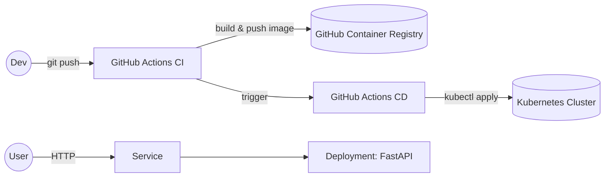

# Cloud-Native AI: Automate, Containerize, Deploy

An end-to-end minimal AI app (FastAPI + scikit-learn) with Docker, CI/CD via GitHub Actions, and Kubernetes deployment (Minikube or any cluster via kubeconfig).

## Architecture



## Stack
- **API**: FastAPI (`app/main.py`)
- **Model**: scikit-learn LogisticRegression on Iris (`app/model.py`)
- **Metrics**: Prometheus `/metrics`
- **Container**: Dockerfile (image <300MB)
- **Kubernetes**: `k8s/` with `Deployment`, `Service`, `Namespace`
- **CI**: `.github/workflows/ci.yml`
- **CD**: `.github/workflows/cd.yml`

## Local development

- Install Python 3.11
- Install deps:
```bash
pip install -r requirements.txt
uvicorn app.main:app --reload
```
- Open: http://localhost:8000/docs

## Container build
```bash
docker build -t ai-demo:local .
docker run -p 8000:8000 ai-demo:local
```

## Minikube quickstart
```bash
minikube start
kubectl apply -f k8s/namespace.yaml
kubectl -n ai-demo apply -f k8s/service.yaml -f k8s/deployment.yaml
kubectl -n ai-demo rollout status deployment/ai-demo
minikube service -n ai-demo ai-demo --url
```

## GitHub Actions

### CI
- Runs tests, builds, and pushes images to GHCR:
  - `ghcr.io/OWNER/REPO:latest`
  - `ghcr.io/OWNER/REPO:${GITHUB_SHA}`

### CD
- Requires secret `KUBECONFIG_DATA` (base64-encoded kubeconfig with access to your cluster)
- Applies manifests and updates image to `:latest`

## Configuration
- Update image in `k8s/deployment.yaml` or rely on CD step `set image`.
- For private GHCR, create image pull secret and patch ServiceAccount.

## Endpoints
- `GET /healthz`
- `POST /predict` with body `{ "features": [f1, f2, f3, f4] }`
- `GET /metrics` Prometheus format

## Monitoring (optional)
- If you have Prometheus Operator, add a `ServiceMonitor`. Example not included by default.

## Evidence & Demo Checklist
- CI logs (build + push)
- CD logs (kubectl apply + rollout)
- `kubectl get pods -n ai-demo` and `kubectl get svc -n ai-demo`
- `curl` to `/healthz` and `/predict`
- Short screen recording linking the above steps

## Reflection
- Template: `docs/reflection_template.md`

## License
MIT
